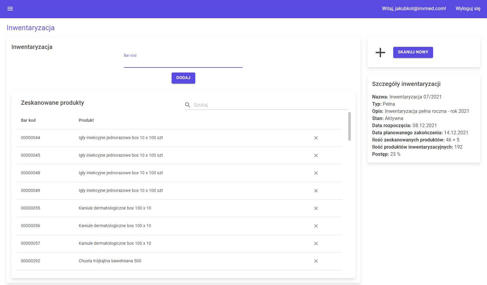

# invMed
invMed is a system supporting the inventory of goods in a medical warehouse. It helps to monitor current flow of goods and carry out inventory in a company. Application is created with Blazor.

## Technologies
* C#
* .NET Core
* Entity Framework
* MS SQL
* Blazor Server
* ASP.NET Core Identity

## Libraries
* MudBlazor
* BarcodeLib
* iTextSharp.LGPLv2.Core

## Implemented functions

**Warehouseman**
* check current stock levels
* handle warehouse receiving and dispatch process
* carry out inventory

**Manager**
* monitor current stock levels
* monitor inventories
* create inventory reports
* receive notifications about goods expiration date and low stock levels

**Admin**
* create user account
* manage user account - edit data, change role and password, activate and deactivate account

## Application view
### Warehouseman panel

### Admin panel

### Inventory

### Report

